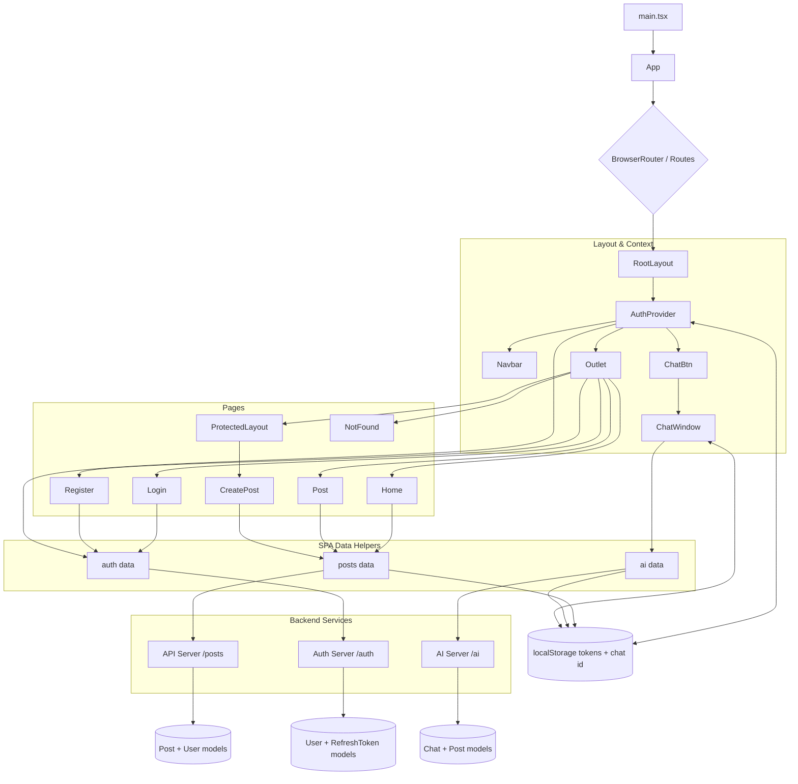

# Full Component Structure & Dependencies

```mermaid
flowchart TD
  main[main.tsx] --> app[App]
  app --> router{BrowserRouter / Routes}
  router --> root[RootLayout]

  subgraph layout[Layout & Context]
    root --> authProvider[AuthProvider]
    authProvider --> navbar[Navbar]
    authProvider --> outlet[Outlet]
    authProvider --> chatBtn[ChatBtn]
    chatBtn --> chatWindow[ChatWindow]
  end

  subgraph pages[Pages]
    outlet --> home[Home]
    outlet --> login[Login]
    outlet --> register[Register]
    outlet --> post[Post]
    outlet --> protected[ProtectedLayout]
    protected --> createPost[CreatePost]
    outlet --> notFound[NotFound]
  end

  subgraph spaData[SPA Data Helpers]
    home --> postsData[posts data]
    post --> postsData
    createPost --> postsData
    login --> authData[auth data]
    register --> authData
    authProvider --> authData
    chatWindow --> aiData[ai data]
  end

  subgraph services[Backend Services]
    postsData --> api[API Server /posts]
    authData --> authServer[Auth Server /auth]
    aiData --> aiServer[AI Server /ai]
  end

  api --> postsDb[(Post + User models)]
  authServer --> authDb[(User + RefreshToken models)]
  aiServer --> aiDb[(Chat + Post models)]

  localStorage[(localStorage tokens + chat id)]
  authProvider <--> localStorage
  postsData --> localStorage
  aiData --> localStorage
  chatWindow <--> localStorage
```

