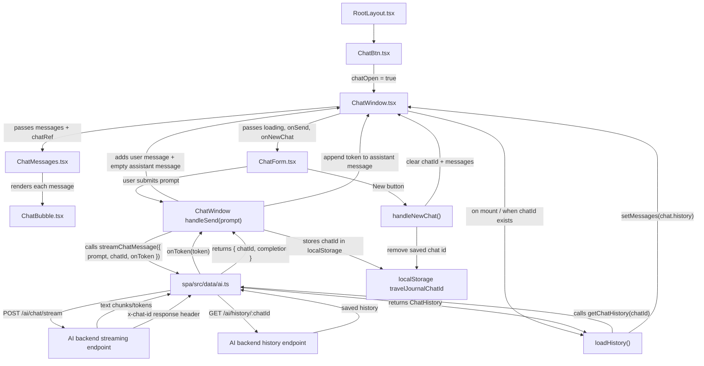

# Chat Components Diagram

## Simple Explanation

`ChatBtn` opens and closes the chat UI.

`ChatWindow` manages the chat state: messages, current chat id, loading state, loading old history, sending new prompts, and updating the assistant response while it streams.

`ChatMessages` displays the message list and scrolls to the newest message.

`ChatBubble` displays one message bubble, either from the user or the travel assistant.

`ChatForm` lets the user type a prompt, send it, or start a new chat.

`spa/src/data/ai.ts` talks to the AI backend. It streams new assistant responses and loads saved chat history.

## Component Details

### `ChatBtn.tsx`

`ChatBtn` is the floating AI button in the bottom-right corner of the app.

It keeps track of whether the chat is open:

```tsx
const [chatOpen, setChatOpen] = useState(false);
```

When `chatOpen` is `false`, only the round `AI` button is shown.

When the user clicks it, `chatOpen` becomes `true`, and `ChatWindow` appears.

### `ChatWindow.tsx`

`ChatWindow` is the main chat container.

It owns the important chat state:

```tsx
const [messages, setMessages] = useState<ChatMessage[]>([]);
const [chatId, setChatId] = useState<string | null>(() => localStorage.getItem(CHAT_STORAGE_KEY));
const [loading, setLoading] = useState(false);
```

In simple terms:

- `messages` stores what is currently displayed in the chat window.
- `chatId` stores which saved backend chat this frontend is using.
- `loading` is `true` while the AI is answering.
- `chatRef` is used so the chat can scroll to the newest message.

When `ChatWindow` opens and there is already a saved `chatId`, it calls `getChatHistory(chatId)`.

That reloads old messages after a page refresh.

When the user sends a message, `handleSend`:

1. Creates a temporary user message.
2. Creates an empty assistant message.
3. Shows both immediately in the UI.
4. Calls `streamChatMessage`.
5. Adds each streamed token to the assistant bubble.
6. Saves the returned `chatId` in `localStorage`.
7. Stops loading when the response is finished.

### `ChatMessages.tsx`

`ChatMessages` displays the list of messages.

It receives:

```tsx
messages: ChatMessage[];
chatRef: RefObject<HTMLDivElement | null>;
```

If there are no messages, it shows:

```txt
Where should we go next?
```

If there are messages, it renders one `ChatBubble` per message.

It also auto-scrolls to the newest message whenever the last message content changes.

That matters during streaming because the assistant message grows token by token.

### `ChatBubble.tsx`

`ChatBubble` displays one single message.

It checks whether the message came from the assistant:

```tsx
const isAssistant = message.role === 'assistant';
```

If the message is from the assistant, it appears on the left.

If the message is from the user, it appears on the right.

It labels the speaker as either:

```txt
Travel assistant
```

or:

```txt
You
```

It renders message content as Markdown, so the assistant can return formatted answers with lists, links, bold text, and line breaks.

If the assistant message is still empty, it shows a loading animation.

### `ChatForm.tsx`

`ChatForm` is the textarea and buttons at the bottom of the chat.

It stores the text the user is currently typing:

```tsx
const [prompt, setPrompt] = useState('');
```

When the form is submitted, it:

1. Prevents the browser's default form reload.
2. Trims the prompt.
3. Ignores empty prompts.
4. Ignores sends while loading.
5. Calls `onSend(trimmedPrompt)`.
6. Clears the textarea after sending.

`onSend` comes from `ChatWindow`, so `ChatForm` does not talk to the AI server directly.

The `New` button calls `onNewChat`, which clears the current chat and starts fresh.

### `spa/src/data/ai.ts`

`ai.ts` is not a visual component.

It is the frontend API helper that talks to the AI backend.

It has two important functions:

```tsx
streamChatMessage(...)
```

This sends a new prompt to:

```txt
POST /ai/chat/stream
```

It reads the streamed AI answer chunk by chunk and calls `onToken(token)`.

That is how the assistant bubble updates live while the AI is still responding.

```tsx
getChatHistory(chatId)
```

This sends a request to:

```txt
GET /ai/history/:chatId
```

It reloads saved messages for an existing chat.

## Component Interaction Diagram



## Data Flow

1. The user clicks the floating `AI` button in `ChatBtn`.
2. `ChatBtn` opens `ChatWindow`.
3. `ChatWindow` checks `localStorage` for an old `chatId`.
4. If a `chatId` exists, `ChatWindow` calls `getChatHistory(chatId)` from `ai.ts`.
5. The backend returns old messages, and `ChatWindow` puts them into `messages`.
6. `ChatMessages` displays all messages.
7. `ChatBubble` renders each individual message.
8. The user types into `ChatForm`.
9. `ChatForm` calls `onSend(prompt)`.
10. `ChatWindow` adds the user message and an empty assistant message.
11. `ChatWindow` calls `streamChatMessage(...)` from `ai.ts`.
12. `ai.ts` sends the prompt to the backend.
13. The backend streams the assistant answer back.
14. Each streamed token updates the assistant message in the UI.
15. The backend sends back the chat id in the `x-chat-id` header.
16. `ChatWindow` saves that chat id in `localStorage`.

## Main Ownership

| File | Main Job |
| --- | --- |
| `ChatBtn.tsx` | Opens and closes the chat window |
| `ChatWindow.tsx` | Owns chat state and coordinates everything |
| `ChatMessages.tsx` | Displays the message list |
| `ChatBubble.tsx` | Displays one message |
| `ChatForm.tsx` | Handles typing, sending, and new chat |
| `spa/src/data/ai.ts` | Talks to the AI backend |
